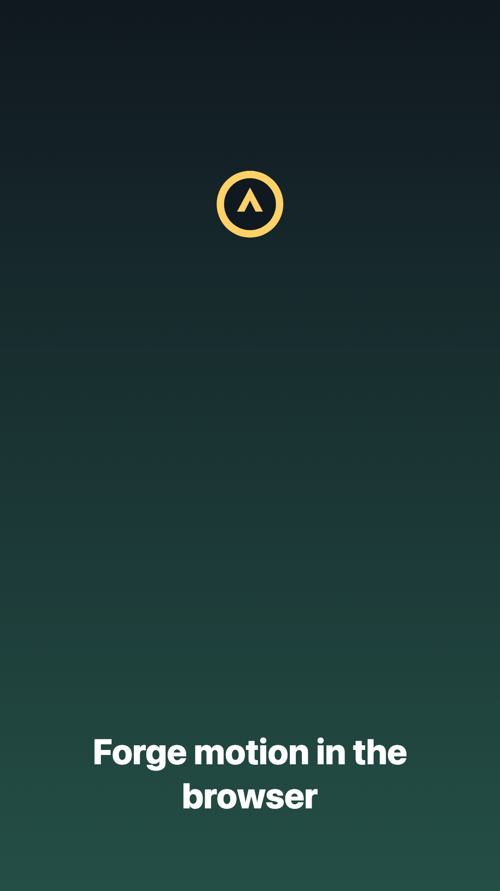
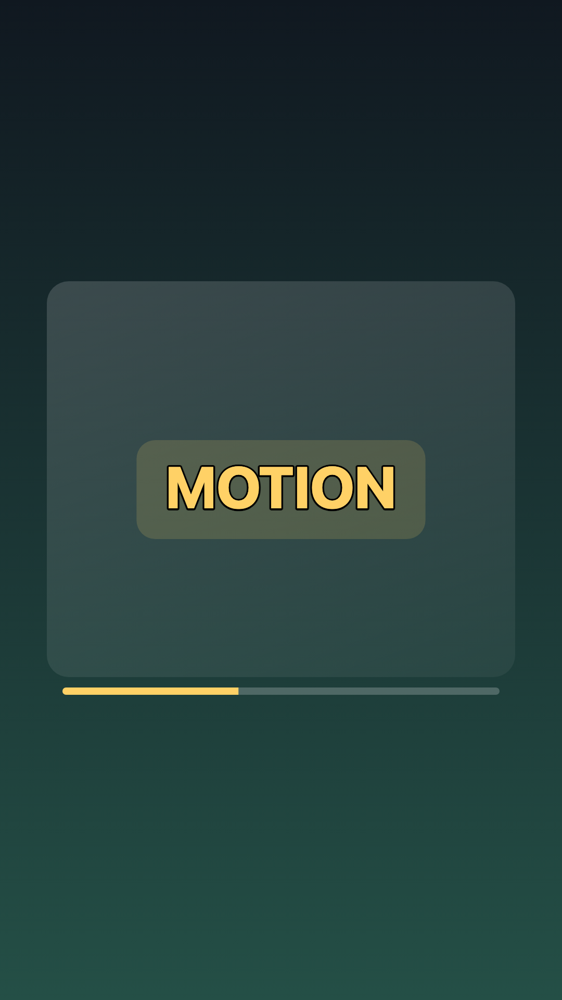
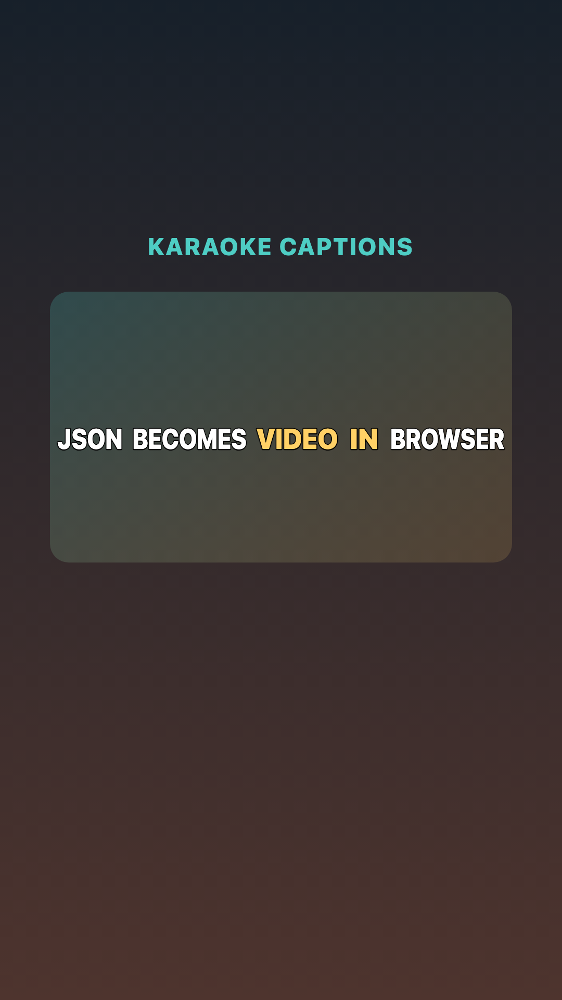
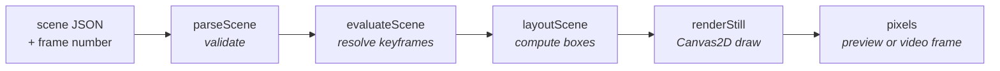
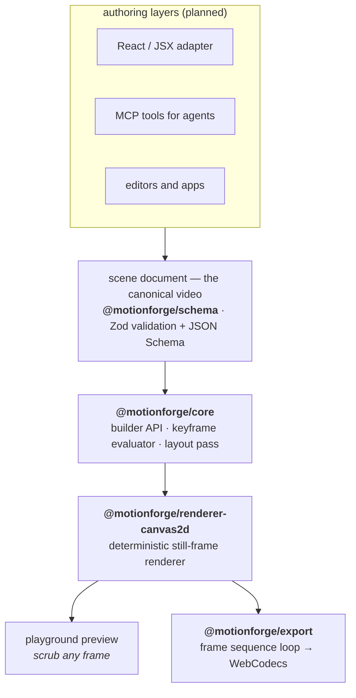

# motionforge

[](https://github.com/PansaLegrand/motionforge/actions/workflows/ci.yml)
[](LICENSE)
[](docs/m0-roadmap.md)
[](CHANGELOG.md)

`motionforge` is a deterministic, browser-native video scene engine for apps and coding agents.


## Showcases

The current engine can already turn plain scene JSON into real MP4s in the browser. These demos are shared between the playground and docs, so the screenshots below come from the same scene data users can scrub and export.

| Engine intro | TikTok captions | Karaoke captions |
| --- | --- | --- |
|  |  |  |

- **Engine intro:** gradients, image assets, text layout, opacity keyframes.
- **TikTok captions:** ASR word timestamps → springy one-word captions with strokes and measured highlight pills.
- **Karaoke captions:** full-line captions with per-word color ramps driven by spoken timestamps.

Try them locally with `pnpm dev`; the playground scene picker can scrub, play, and export each showcase to MP4. See [docs/showcase.md](docs/showcase.md) for source links and render commands.

## The bet

The canonical video is a **serializable scene document**, and preview and export share the **same renderer**. JSX, React, MCP tools, editors, and desktop apps can all sit above that data layer, but the render path stays pure — the same scene JSON and frame number always produce the same pixels:



No wall-clock time, no unseeded randomness, no hidden state. Determinism is enforced by golden tests that hash raw pixels from a pinned Chromium build.

## Architecture



| Package                                                        | What it does                                        | Status     |
| -------------------------------------------------------------- | --------------------------------------------------- | ---------- |
| [`@motionforge/schema`](packages/schema)                       | Scene format, validation, JSON Schema export        | ✅ working |
| [`@motionforge/core`](packages/core)                           | Builder API, keyframe evaluator, layout pass        | ✅ working |
| [`@motionforge/renderer-canvas2d`](packages/renderer-canvas2d) | Canvas2D reference renderer                         | ✅ working |
| [`@motionforge/export`](packages/export)                       | In-browser MP4 export (WebCodecs + mediabunny)      | ✅ working |
| [`@motionforge/presets`](packages/presets)                     | Animation presets + caption generators → scene data | ✅ working |
| [`apps/playground`](apps/playground)                           | Vite preview with frame scrubbing                   | ✅ working |

## Why not Remotion?

Remotion is excellent, and if you want to author videos as React components with the full web platform, use it. motionforge makes a different trade:

- **Data-first, not component-first.** A Remotion video is a React program; a motionforge video is a JSON document. Documents can be validated, diffed, patched, stored, and generated by agents without executing user code.
- **One engine for preview and export.** Remotion previews in the DOM and exports by screenshotting headless Chrome server-side. motionforge renders preview and export through the same Canvas2D path and encodes MP4 in the browser via WebCodecs — no server farm required.
- **Curated subset, not full CSS.** motionforge validates a small CSS-like style set and rejects everything else with actionable errors. You lose expressiveness; you gain a contract that two renderers — and an LLM — can implement faithfully.

If your videos are templated, data-driven, agent-generated, or need to render inside a client app, that trade favors motionforge.

## For coding agents

This project treats LLM agents as first-class users:

- [`llms.txt`](llms.txt) — the compact agent contract: mental model, hard rules, scene shape, supported styles.
- [`docs/scene-format.md`](docs/scene-format.md) — the full format spec with a property-by-property support matrix.
- [`packages/schema/scene.schema.json`](packages/schema/scene.schema.json) — JSON Schema (draft-07) for validating scenes without running any code.
- Validation errors are written to be actionable: they name the path, the problem, and what to do instead. Node ids are unique by contract, so agents can patch scenes by id.

## Quickstart

```sh
pnpm install
pnpm build
pnpm test
pnpm dev   # playground at http://localhost:5173
```

`pnpm test` runs unit tests only. Golden rendering tests are explicit because they need the Playwright-pinned Chromium once per machine:

```sh
pnpm --filter @motionforge/golden exec playwright install chromium
pnpm golden:test
```

Build a scene in TypeScript:

```ts
import { composition, div, text } from "@motionforge/core";
import { renderStill } from "@motionforge/renderer-canvas2d";

const scene = composition({ width: 1080, height: 1920, fps: 30, duration: 120 })
  .children(
    div({
      style: { width: "100%", height: "100%", backgroundColor: "#101820" },
    }),
    text("Hello motionforge", {
      style: {
        position: "absolute",
        left: 64,
        right: 64,
        top: 800,
        fontSize: 72,
        color: "#fff",
        textAlign: "center",
      },
    }).animate("opacity", [
      { frame: 0, value: 0 },
      { frame: 12, value: 1, easing: "easeOut" },
    ]),
  )
  .toJSON(); // plain JSON — store it, diff it, hand it to an agent

renderStill(canvasContext, scene, 30); // any frame, any time, same pixels
```

## Status and M0 scope

M0 is complete and the engine now renders **all four media types**: schema validation, deterministic builder, keyframe evaluation (numbers and colors), the full layout and paint property set, multi-line text with embedded fonts, images with `objectFit`, frame-accurate video clips with trim and playback rate, and audio nodes mixed into the export — all through one in-browser pipeline (the playground's "Export MP4" button downloads a real video). Not yet there: audio preview playback in the playground (the exported file is the audio source of truth) and video nodes contributing their own audio tracks.

See [docs/roadmap.md](docs/roadmap.md) for the post-M0 plan, [docs/m0-roadmap.md](docs/m0-roadmap.md) for the completed M0 checklist, and [docs/progress.md](docs/progress.md) for the change log.

## Working practice

Every meaningful code slice should include tests or a clear note explaining the current test gap. Progress is recorded in [docs/progress.md](docs/progress.md), and the test approach lives in [docs/testing-strategy.md](docs/testing-strategy.md).

Coding standards and the contribution workflow live in [CONTRIBUTING.md](CONTRIBUTING.md).

## Acknowledgments

motionforge stands on excellent open-source work: [zod](https://github.com/colinhacks/zod) validates the scene contract, [mediabunny](https://github.com/Vanilagy/mediabunny) handles WebCodecs encoding and MP4 muxing, and [Remotion](https://www.remotion.dev/) proved that programmatic video in the web stack is worth betting on.

## License

[MIT](LICENSE)
