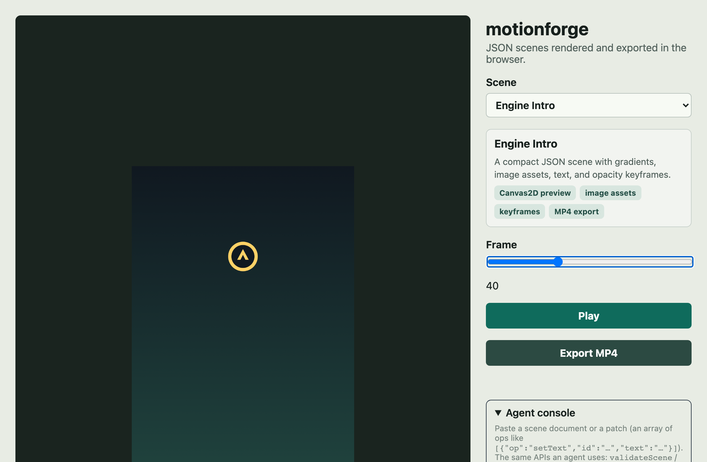
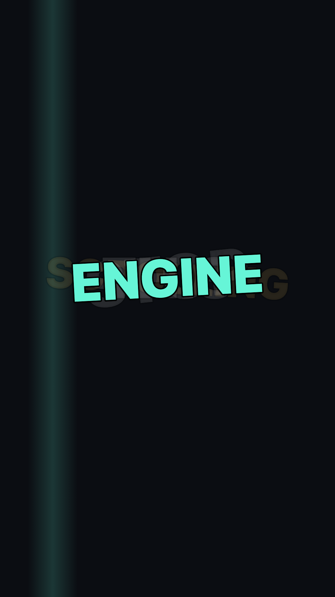
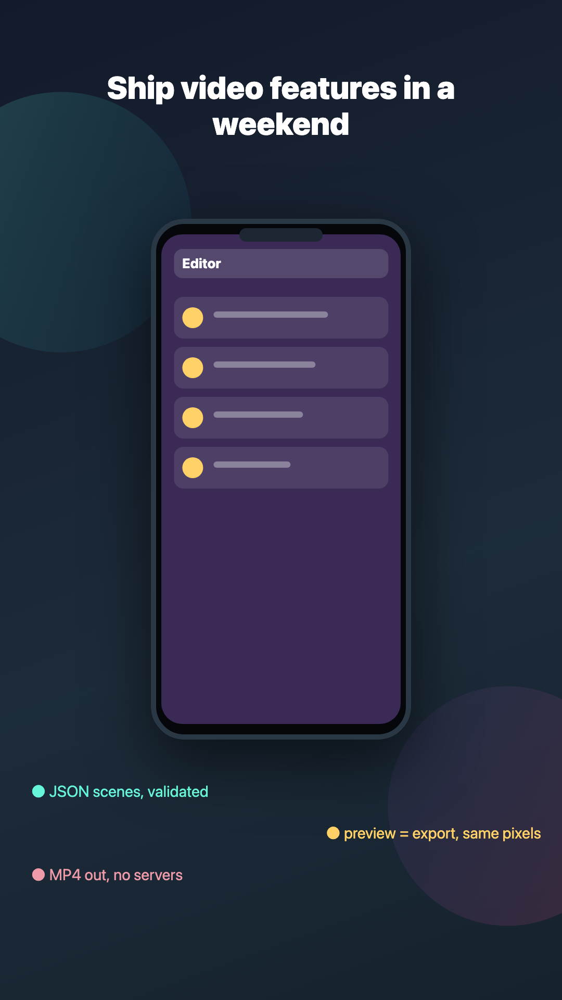
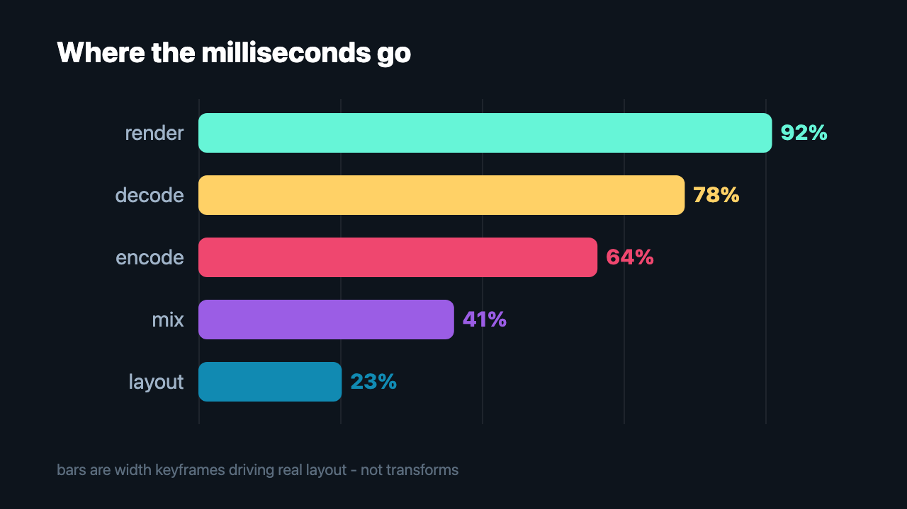
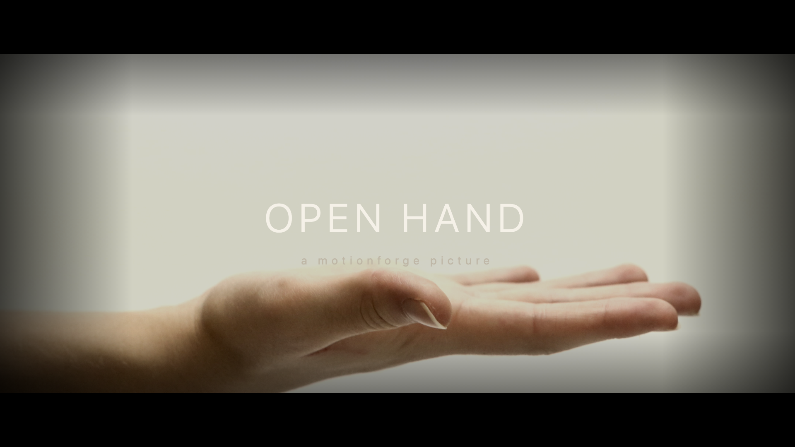
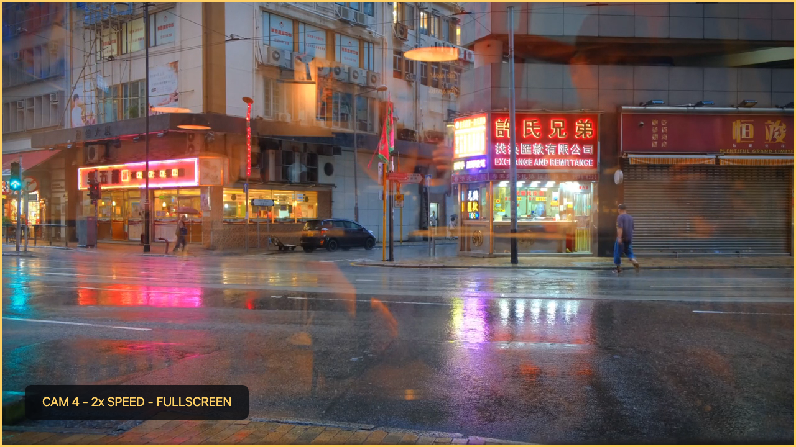
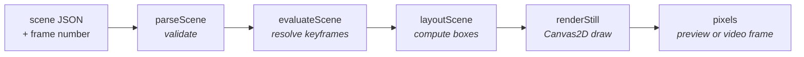
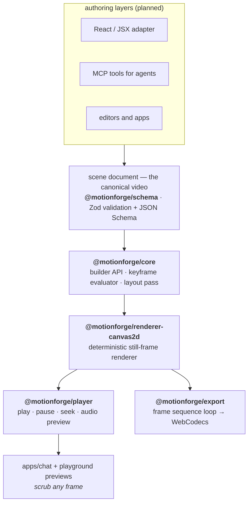

# motionforge

[](https://github.com/PansaLegrand/motionforge/actions/workflows/ci.yml)
[](LICENSE)
[](docs/m0-roadmap.md)
[](CHANGELOG.md)

`motionforge` is a deterministic, browser-native video scene engine for apps and coding agents. Write videos as TypeScript or JSON, then preview, patch, validate, and export the same canonical scene document.



## Showcases

The current engine can turn plain scene JSON into demo-grade MP4s in the browser. The six verification scenes below are intentionally showy: motion-design pacing, audio sync, clipped mockups, animated layout, media compositing, and cinematic text treatment from serializable documents.

| Demo                                                           | Preview                                                                                                                                          | Scene JSON                                        | What to watch                                                                                                                                                     |
| -------------------------------------------------------------- | ------------------------------------------------------------------------------------------------------------------------------------------------ | ------------------------------------------------- | ----------------------------------------------------------------------------------------------------------------------------------------------------------------- |
| [Kinetic Typography](verification/edgy-kinetic-typography.mp4) | [](verification/edgy-kinetic-typography.mp4) | [JSON](verification/edgy-kinetic-typography.json) | 1080x1920@60: words slam in with spring scale, previous words dim into a stacked trail, an accent light sweeps across, and the tagline tracks in.                 |
| [App Promo](verification/edgy-app-promo.mp4)                   | [](verification/edgy-app-promo.mp4)                            | [JSON](verification/edgy-app-promo.json)          | Phone mockup pops in, three app screens slide inside a rounded overflow clip, notch stays above via `zIndex`, and feature bullets stagger from alternating sides. |
| [Animated Chart](verification/edgy-animated-chart.mp4)         | [](verification/edgy-animated-chart.mp4)            | [JSON](verification/edgy-animated-chart.json)     | Agent-generated data-viz: bars grow through eased `width` keyframes that drive real layout, with labels and percentages landing on the same frame grid.           |
| [Beat Edit](verification/edgy-beat-edit.mp4)                   | [](verification/edgy-beat-edit.mp4)                            | [JSON](verification/edgy-beat-edit.json)          | Turn sound on: synthesized drums, photo punches on each beat, snare flashes, Lottie stars, word slams, and per-section hue-shifted color grade.                   |
| [Cinematic Title](verification/edgy-cinematic-title.mp4)       | [](verification/edgy-cinematic-title.mp4)         | [JSON](verification/edgy-cinematic-title.json)    | 1920x1080@24 film card: Ken Burns drift on graded footage, vignette, letterbox bars, and title tracking via animated `letterSpacing`.                             |
| [Multicam Layout](verification/edgy-multicam.mp4)              | [](verification/edgy-multicam.mp4)                              | [JSON](verification/edgy-multicam.json)           | Four simultaneous video decoders in a 2x2 grid; at 2s, CAM 4 animates `left`/`top`/`width`/`height` to fullscreen with audio.                                     |

Together they exercise animated layout (`width`, `left`, `top`, `borderRadius`, `letterSpacing`), per-section `filter` keyframes, Lottie synced to beats, nested overflow clipping, deterministic synthesized audio, and multi-video compositing. They are authored as scene JSON today; a natural-language compiler or editor can sit above the same contract.

The playground also ships a curated showcase catalog from `@motionforge/showcase` for product-shaped demos and docs. See [docs/showcase.md](docs/showcase.md) for the full set, including text and subtitle stress galleries, [Lottie Sticker](examples/generated/lottie-sticker.mp4) ([JSON](examples/generated/lottie-sticker.json)), and generated scene JSON you can inspect or render locally.

## The bet

The canonical video is a **serializable scene document**, and preview and export share the **same renderer**. JSX, React, MCP tools, editors, and desktop apps can all sit above that data layer, but the render path stays pure — the same scene JSON and frame number always produce the same pixels:



No wall-clock time, no unseeded randomness, no hidden state. Determinism is enforced by golden tests that hash raw pixels from a pinned Chromium build.

## Architecture



| Package                                                        | What it does                                         | Status     |
| -------------------------------------------------------------- | ---------------------------------------------------- | ---------- |
| [`@motionforge/authoring`](packages/authoring)                 | Seconds-first TypeScript authoring helpers           | ✅ working |
| [`@motionforge/cli`](packages/cli)                             | Validate, print, and preview scene modules           | ✅ working |
| [`create-motionforge`](packages/create-motionforge)            | Starter project generator                            | ✅ working |
| [`@motionforge/schema`](packages/schema)                       | Scene format, validation, JSON Schema export         | ✅ working |
| [`@motionforge/core`](packages/core)                           | Builder API, keyframe evaluator, layout pass         | ✅ working |
| [`@motionforge/renderer-canvas2d`](packages/renderer-canvas2d) | Canvas2D reference renderer                          | ✅ working |
| [`@motionforge/export`](packages/export)                       | In-browser MP4 export (WebCodecs + mediabunny)       | ✅ working |
| [`@motionforge/presets`](packages/presets)                     | Motion presets, caption templates, timeline compiler | ✅ working |
| [`@motionforge/player`](packages/player)                       | Real-time playback, seeking, audio-synced preview    | ✅ working |
| [`@motionforge/showcase`](packages/showcase)                   | Private shared scenes for playground/docs/examples   | ✅ working |
| [`apps/chat`](apps/chat)                                       | Next.js chat + manual editor reference app           | ✅ working |
| [`apps/playground`](apps/playground)                           | Vite showcase playground + agent console             | ✅ working |
| [`tools/golden`](tools/golden)                                 | Pixel goldens, E2E, benchmarks, render helpers       | ✅ working |
| [`tools/agent-eval`](tools/agent-eval)                         | Private mechanical eval harness for LLM scene edits  | ✅ working |

## Why not Remotion?

Remotion is excellent, and if you want to author videos as React components with the full web platform, use it. motionforge makes a different trade:

- **Data-first, not component-first.** A Remotion video is a React program; a motionforge video is a JSON document. Documents can be validated, diffed, patched, stored, and generated by agents without executing user code.
- **One engine for preview and export.** Remotion previews in the DOM and exports by screenshotting headless Chrome server-side. motionforge renders preview and export through the same Canvas2D path and encodes MP4 in the browser via WebCodecs — no server farm required.
- **Curated subset, not full CSS.** motionforge validates a small CSS-like style set and rejects everything else with actionable errors. You lose expressiveness; you gain a contract that two renderers — and an LLM — can implement faithfully.

If your videos are templated, data-driven, agent-generated, or need to render inside a client app, that trade favors motionforge.

## For coding agents

This project treats LLM agents as first-class users:

- [`llms.txt`](llms.txt) — the compact agent contract: mental model, hard rules, scene shape, supported styles.
- [`docs/scene-format.md`](docs/scene-format.md) — the full format spec with a property-by-property support matrix.
- [`packages/schema/scene.schema.json`](packages/schema/scene.schema.json) — JSON Schema (draft-07) for validating scenes without running any code.
- Validation errors are written to be actionable: they name the path, the problem, and what to do instead. Node ids are unique by contract, so agents can patch scenes by id.
- **Scene patches** ([RFC 0001](docs/rfcs/0001-scene-patch-ops.md)): `applyScenePatch(scene, ops)` applies id-addressed, transactional edits — the API a chat loop drives. Misspelled ids get closest-match suggestions in the error.
- **Try the loop by hand**: the playground's _Agent console_ lets you paste a scene or a patch, applies it through these exact APIs, and shows you the same errors an agent would read.
- [`tools/agent-eval`](tools/agent-eval) runs generate/edit suites against any OpenAI-compatible chat endpoint and scores the result mechanically with the same validation and patch APIs.

## Quickstart

Create a programmer-authored MotionForge video:

```sh
pnpm create motionforge hello-video
cd hello-video
pnpm install
pnpm dev
```

The starter project contains `src/video.ts`. `pnpm dev` runs `motionforge dev src/video.ts`, which opens MotionForge Studio with preview, play/pause, frame scrubbing, scene JSON inspection, validation feedback, and browser MP4 export when WebCodecs is available.

To work on this repository:

```sh
pnpm install
pnpm build
pnpm test
pnpm dev   # Next.js chat app at http://localhost:5174
```

`pnpm dev` starts the chat app by default. To run the older Vite playground explicitly:

```sh
pnpm dev:playground   # playground at http://localhost:5173
```

The chat app runs with a local fallback when no model credentials are set. For LLM-backed generation, copy the example env file and choose a provider:

```sh
cp apps/chat/.env.example apps/chat/.env.local
```

Vercel AI Gateway is the default:

```sh
MOTIONFORGE_LLM_PROVIDER=gateway
AI_GATEWAY_API_KEY=...
MOTIONFORGE_CHAT_MODEL=openai/gpt-4.1-mini
```

For your own OpenAI-compatible provider, switch the provider and set its base URL:

```sh
MOTIONFORGE_LLM_PROVIDER=openai-compatible
MOTIONFORGE_OPENAI_COMPATIBLE_BASE_URL=https://api.openai.com/v1
MOTIONFORGE_OPENAI_COMPATIBLE_API_KEY=...
MOTIONFORGE_OPENAI_COMPATIBLE_NAME=custom
MOTIONFORGE_CHAT_MODEL=gpt-4.1-mini
```

`pnpm test` runs unit tests only. Golden rendering tests are explicit because they need the Playwright-pinned Chromium once per machine:

```sh
pnpm --filter @motionforge/golden exec playwright install chromium
pnpm golden:test
```

Before tagging or publishing, use the release gates:

```sh
pnpm release:fast  # typecheck, unit tests, lint, build, CLI/starter smoke
pnpm release:full  # fast gate + goldens, E2E, package pack dry-runs
pnpm verify:clean  # pack packages, install a starter in /tmp, validate/inspect/build
pnpm resource:smoke # long-scene chunk/loop/many-node resource assertions
```

Use `pnpm verify:clean -- --keep` when you want to preserve the temporary starter and manually run `pnpm dev` to inspect Studio or browser MP4 export.

Write a scene in TypeScript with the authoring helpers:

```ts
import {
  bg,
  fadeUp,
  image,
  imageAsset,
  makeScene,
  publicAsset,
  seconds,
  textBlock,
  title,
} from "@motionforge/authoring";

const logo = imageAsset("logo", publicAsset("assets/logo.svg"));

export default makeScene({
  size: "portrait",
  fps: 30,
  duration: seconds(5),
  children: [
    bg("#0f172a"),
    image(logo, {
      at: seconds(0.2),
      duration: seconds(4.6),
      style: { left: 432, top: 360, width: 216, height: 216 },
    }),
    title("Hello MotionForge", {
      at: seconds(0.8),
      duration: seconds(3),
      enter: fadeUp(),
    }),
    textBlock("Deterministic video as TypeScript data.", {
      at: seconds(1.4),
      enter: fadeUp({ delay: 6 }),
    }),
  ],
});
```

Use robust overlays when copy or captions come from users, chat, transcripts, or data:

```ts
import {
  makeScene,
  parseSrt,
  seconds,
  subtitleTrack,
  textBox,
} from "@motionforge/authoring";

const subtitles = parseSrt(`1
00:00:00,500 --> 00:00:02,100
I love this

2
00:00:02,400 --> 00:00:04,800
Keep long subtitle text readable`);

export default makeScene({
  size: "portrait",
  fps: 30,
  duration: seconds(5),
  children: [
    textBox("Launch Week: every update in under one minute", {
      placement: "title",
      maxLines: 2,
    }),
    subtitleTrack(subtitles, {
      template: "minimalBar",
      maxLines: 2,
    }),
  ],
});
```

This emits plain validated scene JSON. Use the lower-level builder when you want direct control over every node:

For local media in CLI Studio, put files under `public/assets` and reference them as `publicAsset("assets/file.ext")`, which emits `/assets/file.ext` in the scene JSON.

Validate or inspect a scene module with the CLI:

```sh
motionforge validate src/video.ts
motionforge print src/video.ts
motionforge inspect src/video.ts
motionforge dev src/video.ts
```

The CLI accepts `.json`, `.js`, `.mjs`, `.cjs`, `.ts`, `.mts`, and `.cts` scene modules. A module can default-export a `Scene`, a function returning a `Scene`, or a promise. `motionforge dev` hosts the Studio directly from the CLI, so a new project does not need preview boilerplate.

## Programmer guides

- [Getting Started](docs/guides/getting-started.md)
- [Authoring API](docs/guides/authoring-api.md)
- [Animation Guide](docs/guides/animation.md)
- [Media Guide](docs/guides/media.md)
- [Preview And Export](docs/guides/preview-export.md)
- [Preset Catalog](docs/guides/preset-catalog.md)
- [MotionForge vs Remotion](docs/guides/motionforge-vs-remotion.md)
- [Agent-Generated Scenes](docs/guides/agent-generated-scenes.md)

```ts
import { composition, div, text } from "@motionforge/core";
import { renderStill } from "@motionforge/renderer-canvas2d";

const scene = composition({ width: 1080, height: 1920, fps: 30, duration: 120 })
  .children(
    div({
      style: { width: "100%", height: "100%", backgroundColor: "#101820" },
    }),
    text("Hello motionforge", {
      style: {
        position: "absolute",
        left: 64,
        right: 64,
        top: 800,
        fontSize: 72,
        color: "#fff",
        textAlign: "center",
      },
    }).animate("opacity", [
      { frame: 0, value: 0 },
      { frame: 12, value: 1, easing: "easeOut" },
    ]),
  )
  .toJSON(); // plain JSON — store it, diff it, hand it to an agent

renderStill(canvasContext, scene, 30); // any frame, any time, same pixels
```

## Status and M0 scope

M0 is complete and the engine now renders **all four media types**: schema validation, deterministic builder, keyframe evaluation (numbers and colors), the full layout and paint property set, multi-line text with embedded fonts, images with `objectFit`, frame-accurate video clips with trim and playback rate, Lottie vector assets, audio nodes, and video-node soundtracks. Preview and export share one in-browser pipeline: the player previews sound with the same mix functions the exporter muxes into MP4, and the playground's "Export MP4" button downloads a real video.

Current known limits: preview audio is best-effort and mixed into one cached buffer per scene, large source videos are fetched as whole blobs for deterministic decode, and hosted web-app deployment is intentionally not wired from this repo right now.

See [docs/roadmap.md](docs/roadmap.md) for the post-M0 plan, [docs/m0-roadmap.md](docs/m0-roadmap.md) for the completed M0 checklist, and [docs/progress.md](docs/progress.md) for the change log.

## Working practice

Every meaningful code slice should include tests or a clear note explaining the current test gap. Progress is recorded in [docs/progress.md](docs/progress.md), and the test approach lives in [docs/testing-strategy.md](docs/testing-strategy.md).

Coding standards and the contribution workflow live in [CONTRIBUTING.md](CONTRIBUTING.md).

## Acknowledgments

motionforge stands on excellent open-source work: [zod](https://github.com/colinhacks/zod) validates the scene contract, [mediabunny](https://github.com/Vanilagy/mediabunny) handles WebCodecs encoding and MP4 muxing, and [Remotion](https://www.remotion.dev/) proved that programmatic video in the web stack is worth betting on.

## License

[MIT](LICENSE)
