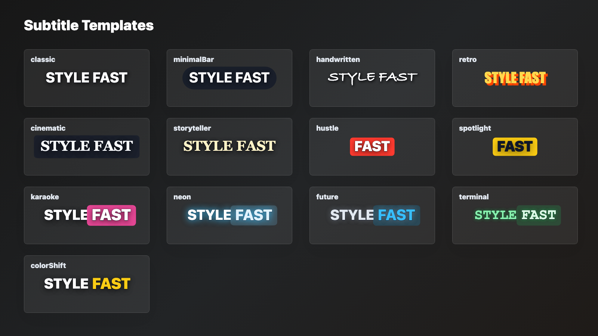
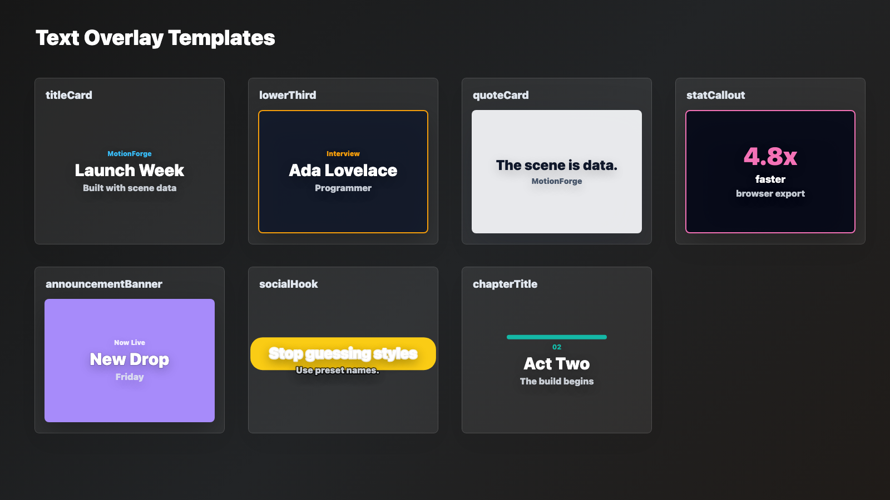
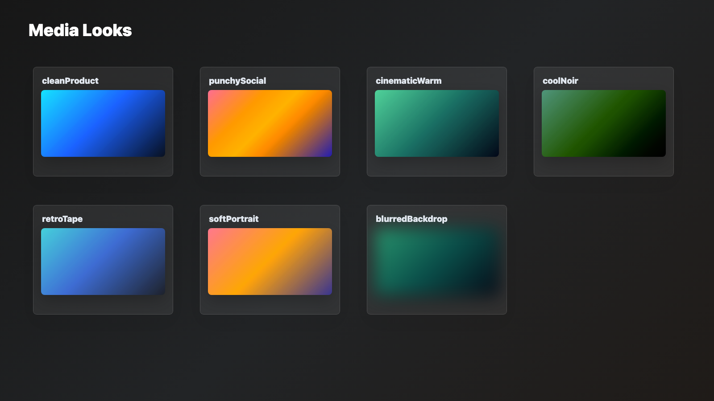
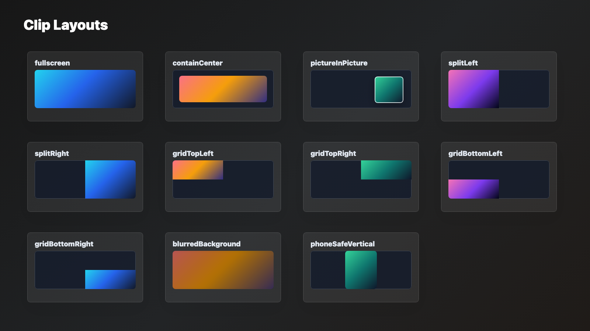
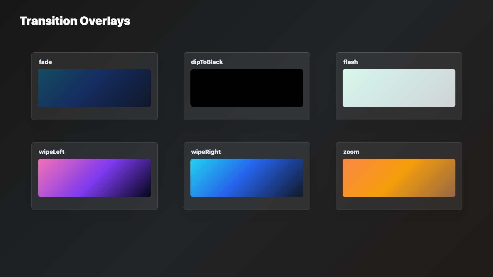

# Preset Catalog

MotionForge presets are stable names that compile to normal scene data. Use this page as the quick lookup table for programmers, apps, and agents.

## Subtitle Templates

Use `styledCaptions(words, { fps, template })` for ASR word timings, or `subtitleTrack(segments, { fps, template })` for SRT/VTT-style subtitle cues.



| Key           | Best For                                                |
| ------------- | ------------------------------------------------------- |
| `classic`     | Clean readable subtitles with a strong outline          |
| `minimalBar`  | Compact pill-backed captions                            |
| `handwritten` | Friendly casual narration                               |
| `retro`       | Vintage golden title/subtitle energy                    |
| `cinematic`   | Premium serif captions with restrained backing          |
| `storyteller` | Warm interview or recap narration                       |
| `hustle`      | One-word punch captions with red active badges          |
| `spotlight`   | Short-form captions with bright active pills            |
| `karaoke`     | Full-line captions with active-word emphasis            |
| `neon`        | Electric captions with glow                             |
| `future`      | Clean tech subtitles                                    |
| `terminal`    | Code-inspired green captions                            |
| `colorShift`  | High-contrast karaoke captions with color-only emphasis |

```ts
scene.nodes.push(
  styledCaptions(words, {
    fps: 30,
    template: "spotlight",
  }),
);
```

```ts
scene.nodes.push(
  subtitleTrack(
    [
      { text: "First subtitle.", startSeconds: 0.4, endSeconds: 2.1 },
      { text: "Second subtitle.", startSeconds: 2.4, endSeconds: 4.2 },
    ],
    {
      fps: 30,
      template: "minimalBar",
      composition: { width: scene.width, height: scene.height },
    },
  ),
);
```

## Text Overlay Templates

Use with `textOverlay({ template })`.



| Key                  | Required Text | Best For                       |
| -------------------- | ------------- | ------------------------------ |
| `titleCard`          | `title`       | Opening title stacks           |
| `lowerThird`         | `title`       | Speaker labels, subject labels |
| `quoteCard`          | `body`        | Pull quotes and testimonials   |
| `statCallout`        | `value`       | Metrics and numeric proof      |
| `announcementBanner` | `title`       | Launch, sale, or alert strips  |
| `socialHook`         | `title`       | Short-form hook text           |
| `chapterTitle`       | `title`       | Section breaks                 |

Text overlay slots use robust bounded text defaults: shrink-to-fit, ellipsis, hidden overflow, and slot-specific `maxLines`. Pass `composition` to opt into safe-area placement, and override any generated slot style through `titleStyle`, `bodyStyle`, `subtitleStyle`, and related style options.

```ts
scene.nodes.push(
  textOverlay({
    template: "lowerThird",
    title: "Ada Lovelace",
    subtitle: "Programmer",
    composition: { width: scene.width, height: scene.height },
    from: 30,
    duration: 120,
  }),
);
```

## Media Looks

Use with `mediaLook(key)` inside an image or video style.



| Key               | Best For                                |
| ----------------- | --------------------------------------- |
| `cleanProduct`    | Product shots, UI footage               |
| `punchySocial`    | High-energy social clips                |
| `cinematicWarm`   | Warm narrative footage                  |
| `coolNoir`        | Dramatic low-saturation scenes          |
| `retroTape`       | Soft analog warmth                      |
| `softPortrait`    | People-focused clips                    |
| `blurredBackdrop` | Background media behind foreground text |

```ts
videoClip(clip, {
  style: {
    ...clipLayout("fullscreen"),
    ...mediaLook("cinematicWarm"),
  },
});
```

## Clip Layouts

Use with `clipLayout(key)` inside an image or video style.



| Key                 | Best For                         |
| ------------------- | -------------------------------- |
| `fullscreen`        | Full-frame cropped media         |
| `containCenter`     | Full source visible inside frame |
| `pictureInPicture`  | Floating small video card        |
| `splitLeft`         | Left half of a split screen      |
| `splitRight`        | Right half of a split screen     |
| `gridTopLeft`       | Top-left cell of a 2x2 grid      |
| `gridTopRight`      | Top-right cell of a 2x2 grid     |
| `gridBottomLeft`    | Bottom-left cell of a 2x2 grid   |
| `gridBottomRight`   | Bottom-right cell of a 2x2 grid  |
| `blurredBackground` | Blurred full-frame backdrop      |
| `phoneSafeVertical` | Vertical crop for phone footage  |

## Transition Overlays

Use with `transitionOverlay(template, options)`.



| Key          | Best For                   |
| ------------ | -------------------------- |
| `fade`       | General soft cut           |
| `dipToBlack` | Section break              |
| `flash`      | Beat cut or emphasis       |
| `wipeLeft`   | Graphic leftward wipe      |
| `wipeRight`  | Graphic rightward wipe     |
| `zoom`       | Energetic transition flash |

```ts
scene.nodes.push(
  transitionOverlay("flash", {
    at: 90,
    duration: 10,
    color: "rgba(255,255,255,0.9)",
  }),
);
```

## Agent Hint

Use preset names in prompts and patches instead of inventing raw styles:

```txt
Use spotlight subtitles, a cinematic warm look, and a lower third for the speaker.
```

The implementation should compile those names into `styledCaptions()`, `mediaLook("cinematicWarm")`, and `textOverlay({ template: "lowerThird" })`.

## Regenerating Previews

The gallery scenes live under `examples/generated/presets` and are generated from `examples/generate-preset-gallery.mjs`:

```sh
pnpm build
pnpm presets:generate
```

Use the render commands in `examples/README.md` to refresh the committed PNG thumbnails.
