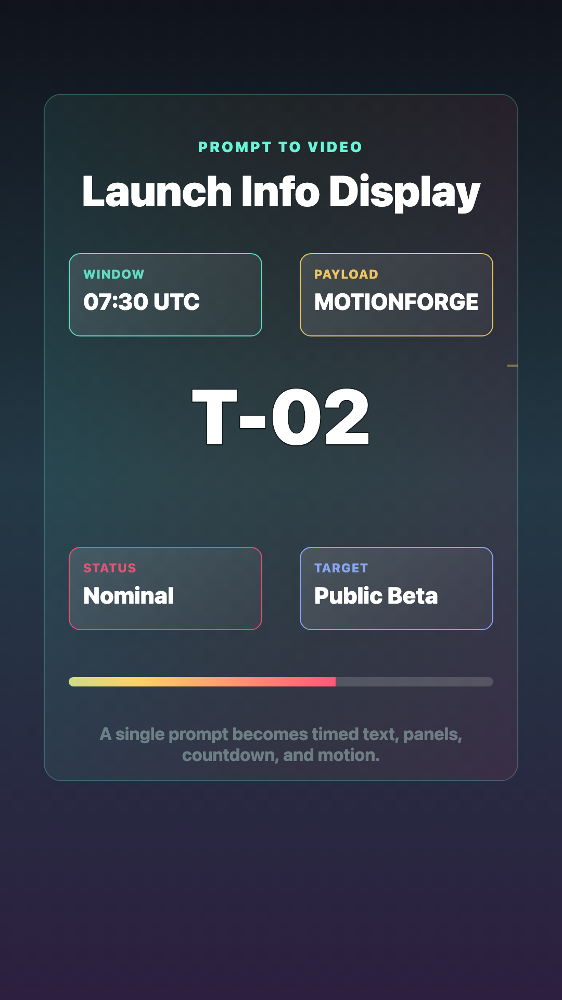
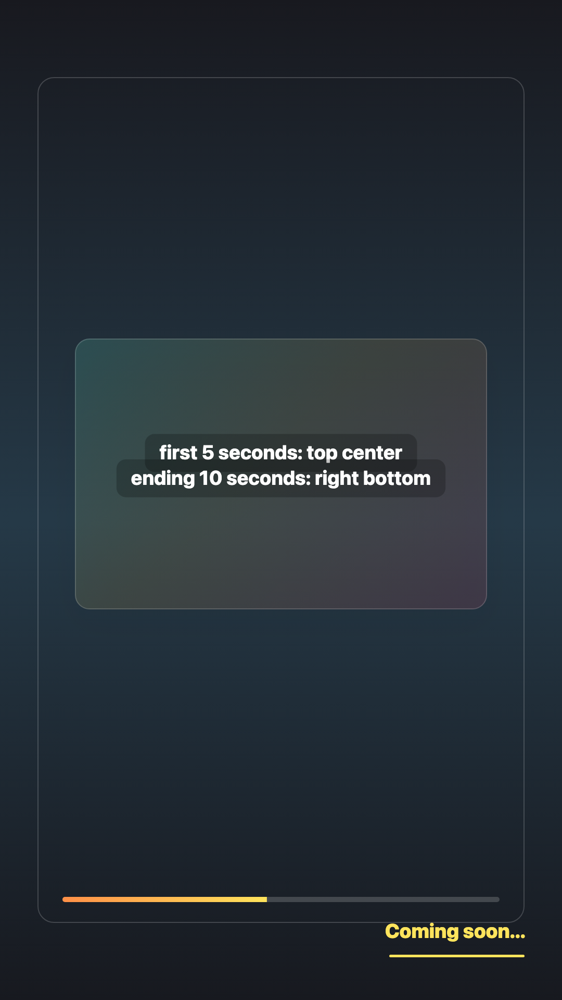
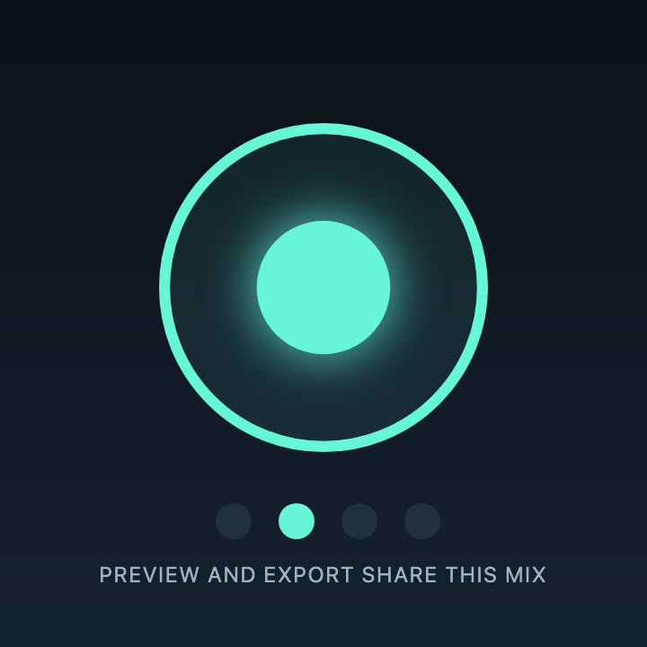
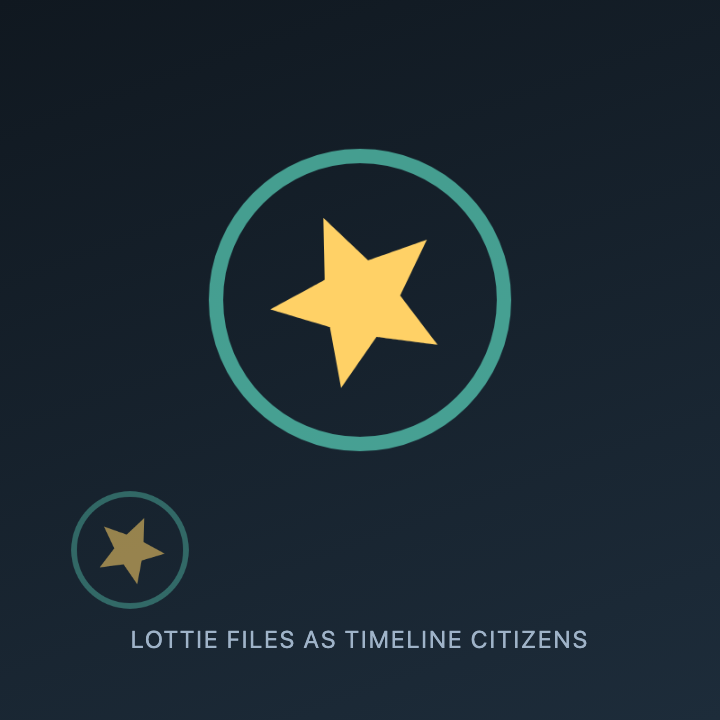

# Showcase

These scenes are the public proof that motionforge's JSON-to-video pipeline is useful today. They live in `@motionforge/showcase`, feed the playground scene picker, and can be exported to JSON under `examples/generated`.

## Render Commands

```sh
pnpm build
pnpm showcase:generate
pnpm --filter @motionforge/golden run example examples/generated/tiktok-captions.json out/tiktok-captions.mp4 60
```

The trailing frame numbers write poster PNGs next to the MP4.

## Scenes

| Scene               | Poster                                                                                    | What It Proves                                                                                                                     |
| ------------------- | ----------------------------------------------------------------------------------------- | ---------------------------------------------------------------------------------------------------------------------------------- |
| Engine Intro        |                       | Gradients, image assets, text layout, opacity keyframes, MP4 export                                                                |
| TikTok Captions     |          | `tiktokCaptions()` compiles ASR timestamps into timed caption nodes with spring transforms, text stroke, and measured fitted pills |
| Karaoke Captions    |        | `karaokeCaptions()` keeps a full line visible while per-word color keyframes track spoken timestamps                               |
| Launch Info Display |  | Prompt-shaped scene generation: animated panels, scan lines, countdown timing, and progress motion from one serializable document  |
| Timed Text Overlay  |    | Written timing instructions mapped to exact text nodes: first 5 seconds top-center, final 10 seconds bottom-right                  |
| Audio Sync Pulse    |        | A synthesized WAV data URL with beat-locked keyframes: audible in player preview, mixed into the AAC export                        |
| Lottie Sticker      |            | A self-contained vector Lottie document seeked frame-exactly; the same asset at two playback rates                                 |

## Prompt-Style Readiness

motionforge can already render and export prompt-shaped results once the prompt has been compiled into scene JSON. The missing product layer is the natural-language compiler/editor that turns text such as "first 5 seconds, write motionforge.dev..." into that JSON automatically. The agent console and patch API are the current bridge: paste a generated scene or patch, validate it, preview it, and export the MP4 through the same renderer.

## Source

- Shared scene definitions: [packages/showcase/src/index.ts](../packages/showcase/src/index.ts)
- Generated JSON: [examples/generated](../examples/generated)
- Playground: [apps/playground](../apps/playground)

## Why This Matters

The showcase is deliberately data-first: each demo is a serializable scene document, not a React component or a browser screenshot script. Preview and export use the same Canvas2D renderer, so the playground frame and exported MP4 frame come from the same pipeline.
