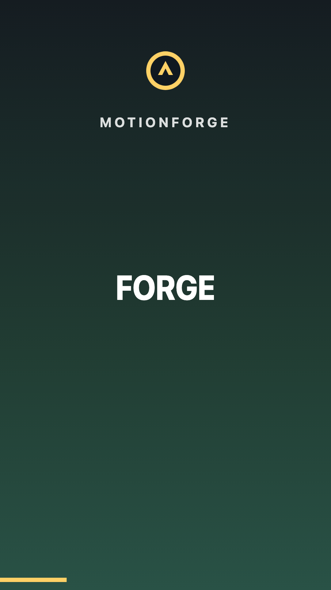
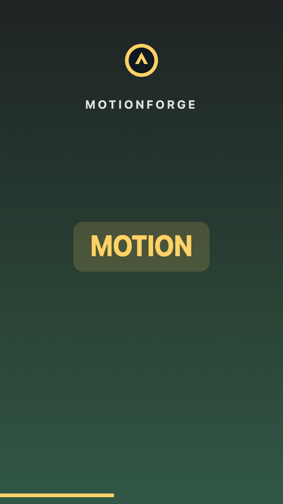
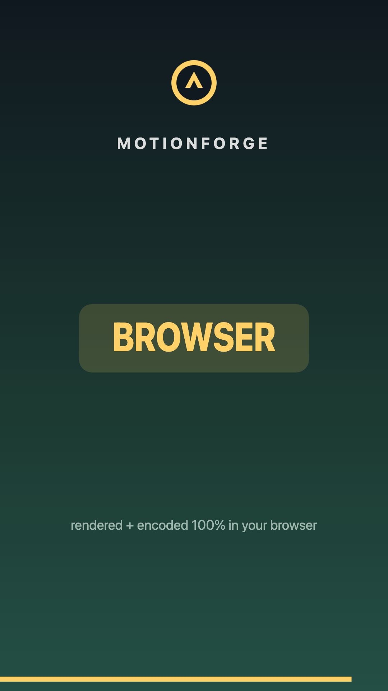

# Examples

Scene documents that produce real videos. Render any of them with:

```sh
pnpm build
pnpm showcase:generate
pnpm --filter @motionforge/golden exec playwright install chromium  # once
pnpm --filter @motionforge/golden run example examples/generated/tiktok-captions.json out.mp4 60
```

The trailing numbers are optional frame indices written as PNGs next to the MP4.

## generated/

`examples/generated/*.json` is produced from the shared showcase scenes:

```sh
pnpm showcase:generate
```

Those scenes also power the playground scene picker, so docs, examples, and preview stay aligned.

`examples/generated/presets/*.json` is produced from the preset gallery scene generator:

```sh
pnpm build
pnpm presets:generate
```

Render the docs thumbnails with the browser golden harness:

```sh
mkdir -p docs/assets/presets
pnpm --filter @motionforge/golden run example examples/generated/presets/preset-subtitles.json docs/assets/presets/preset-subtitles.mp4 45
pnpm --filter @motionforge/golden run example examples/generated/presets/preset-text-overlays.json docs/assets/presets/preset-text-overlays.mp4 45
pnpm --filter @motionforge/golden run example examples/generated/presets/preset-media-looks.json docs/assets/presets/preset-media-looks.mp4 45
pnpm --filter @motionforge/golden run example examples/generated/presets/preset-clip-layouts.json docs/assets/presets/preset-clip-layouts.mp4 45
pnpm --filter @motionforge/golden run example examples/generated/presets/preset-transitions.json docs/assets/presets/preset-transitions.mp4 30
```

The PNG frames are committed for docs. The intermediate MP4 files are ignored.

## Prompt-style examples

The generated showcase now includes two use-case demos aimed at agent and editor workflows:

- `launch-info-display.json` — a prompt-to-video style launch display with animated panels, scan lines, countdown text, and progress motion.
- `timed-text-overlay.json` — a written timing prompt mapped to frame-accurate overlays: `motionforge.dev` at top center for the first 5 seconds, then `Coming soon...` in the bottom-right corner for the final 10 seconds.
- `text-stress-gallery.json` — long Latin, URLs, CJK, emoji, long single-token text, and multiline captions in bounded overlay cards.
- `subtitle-stress-gallery.json` — parsed SRT, parsed WebVTT, manual subtitle segments, long Latin, URLs, CJK, emoji, and fast cue changes in timed subtitle tracks.
- `image-overlay-stress-gallery.json` — logo bug, watermark, transparent sticker, product shot, avatar badge, and oversized corner badge presets in one self-contained scene.
- `video-overlay-stress-gallery.json` — picture-in-picture, reaction cam, screen demo, muted background loop, b-roll strip, and video badge presets backed by one embedded MP4 asset.

These examples prove the scene contract is ready for prompt-generated videos. The repository does not yet ship a natural-language compiler; today an agent, app, or preset layer writes the scene JSON and motionforge validates, previews, and exports it.

Render the text stress gallery when changing text layout or renderer behavior:

```sh
pnpm build
pnpm showcase:generate
pnpm --filter @motionforge/golden run example examples/generated/text-stress-gallery.json out/text-stress-gallery.mp4 30
```

Render the subtitle stress gallery when changing subtitle parsing, templates, or renderer text-fit behavior:

```sh
pnpm build
pnpm showcase:generate
pnpm --filter @motionforge/golden run example examples/generated/subtitle-stress-gallery.json out/subtitle-stress-gallery.mp4 90
```

Render the image overlay stress gallery when changing image assets, object-fit behavior, safe-area placement, or overlay presets:

```sh
pnpm build
pnpm showcase:generate
pnpm --filter @motionforge/golden run example examples/generated/image-overlay-stress-gallery.json out/image-overlay-stress-gallery.mp4 45
```

Render the video overlay stress gallery when changing video trim, playback rate, clip volume, object-fit behavior, rounded crop, or overlay presets:

```sh
pnpm build
pnpm showcase:generate
pnpm --filter @motionforge/golden run example examples/generated/video-overlay-stress-gallery.json out/video-overlay-stress-gallery.mp4 45
```

## Assets And Transcript Files

For browser-served examples, put video, image, audio, subtitle, and transcript assets under the app or project `public/assets` directory. Reference media with `publicAsset("assets/clip.mp4")`, which emits `/assets/clip.mp4` in the scene JSON.

Subtitle text can also live beside the TypeScript scene source when it is read at build time. Parse `.srt` or `.vtt` text with `parseSrt()` or `parseVtt()`, pass the resulting segments to `subtitleTrack()`, and commit the emitted scene JSON. After parsing, subtitles are ordinary timed scene nodes; the renderer does not need a separate subtitle file.

## tiktok-captions.json

The one-word-at-a-time caption style (1080x1920, 30 fps, 5 s): each word is a
text node with `from`/`duration` timing, a `fontSize` pop with `easeOut`,
opacity fade-in, highlight pills behind emphasized words, a color keyframe
(white → gold) on the last word, an animated progress bar, and an SVG image
asset — all from one JSON document, no code.

| frame 30                             | frame 60                             | frame 135                              |
| ------------------------------------ | ------------------------------------ | -------------------------------------- |
|  |  |  |

## generate-tiktok.mjs

The same caption track, generated instead of hand-written: one
`tiktokCaptions(words, { fps, highlightIndices })` call from
[`@motionforge/presets`](../packages/presets) replaces ~300 lines of JSON.
The generated version uses renderer-measured text pills (`textBackgroundColor`
and padding/radius on text nodes) instead of hand-sized wrapper boxes.

```sh
pnpm build
node examples/generate-tiktok.mjs > /tmp/tiktok-presets.json
pnpm --filter @motionforge/golden run example /tmp/tiktok-presets.json out.mp4 50
```
